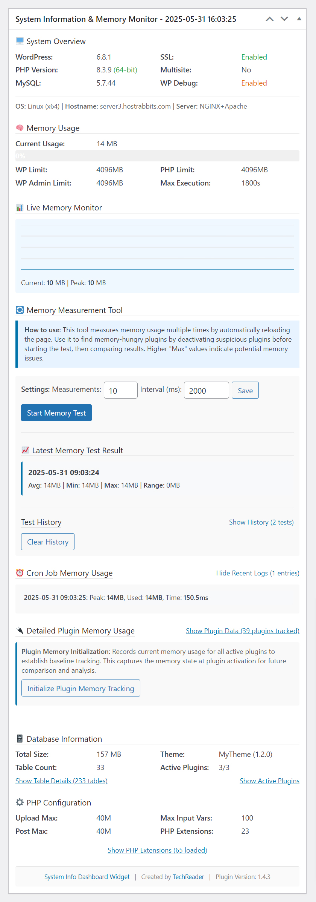

# System Info Dashboard Widget


Comprehensive WordPress system information plugin with real-time memory monitoring, plugin analysis, and performance insights directly in your WordPress dashboard.

## 🚀 Key Features

### **Real-Time Monitoring**
* Live memory usage graph with dynamic scaling
* Real-time system performance metrics
* Automatic updates every 3 seconds

### **Advanced Plugin Analysis**
* Individual plugin memory footprint tracking
* Smart alerts for high memory usage plugins
* Plugin activation/deactivation impact analysis

### **Comprehensive System Information**
* WordPress, PHP, MySQL version details
* Server software and OS distribution detection
* SSL status, debug mode, and security indicators

### **Database Insights**
* Complete database size breakdown
* Table-level analysis with row counts
* Database optimization recommendations

### **Memory Testing Tools**
* Multi-point memory measurement system
* Historical test data with plugin impact tracking
* Configurable test intervals and measurement counts

### **Performance Monitoring**
* Cron job memory usage and execution time tracking
* Background process performance analysis
* System resource utilization metrics

## 📸 Screenshot



## 🎯 Perfect For

* **Developers** - Debug memory issues and optimize plugin performance
* **Site Administrators** - Monitor system health and resource usage
* **Performance Enthusiasts** - Identify optimization opportunities
* **Troubleshooters** - Diagnose site performance problems

## 🔧 Advanced Features

* **Intelligent Alerts**: Smart notifications when plugins exceed memory thresholds
* **Historical Analysis**: Track memory usage patterns over time
* **Interactive Dashboard**: Collapsible sections with modern, responsive design
* **Mobile Friendly**: Works perfectly on all device sizes
* **Zero Configuration**: Works out of the box with sensible defaults

## 💡 Use Cases

1. **Plugin Testing**: Compare memory usage before and after plugin installations
2. **Performance Optimization**: Identify resource-heavy plugins and themes
3. **System Monitoring**: Keep track of server health and WordPress environment
4. **Troubleshooting**: Quickly diagnose memory-related issues
5. **Development**: Monitor application performance during development

## 🛡️ Security & Privacy

* No external connections or data transmission
* All data stored locally in WordPress database
* Secure AJAX requests with proper nonce verification
* Follows WordPress security best practices

## 🔧 Installation

### Automatic Installation (WordPress.org)
1. Go to **Plugins > Add New** in your WordPress admin
2. Search for "System Info Dashboard Widget"
3. Click **Install Now** and then **Activate**

### Manual Installation
1. Download the plugin zip file
2. Upload to `/wp-content/plugins/` directory
3. Unzip the file
4. Activate the plugin through the **Plugins** menu in WordPress

### GitHub Installation
```bash
cd /path/to/wordpress/wp-content/plugins/
git clone https://github.com/lso2/tr-system-info-dashboard-widget.git
```

## 📋 Requirements

- **WordPress**: 5.0 or higher (Tested to 6.8+)
- **PHP**: 7.4 or higher (Tested to 8.3+)
- **MySQL**: 5.6 or higher
- **Memory**: 64MB minimum (128MB recommended)

## 🎮 Usage

### Quick Start
1. After activation, go to your **WordPress Dashboard**
2. Look for the **System Information & Memory Monitor** widget
3. Explore the collapsible sections for detailed information
4. Configure widget sections in **System Info** settings page

### Memory Testing
1. Navigate to the **Memory Measurement Tool** section
2. Configure test settings (number of measurements and interval)
3. Click **Start Memory Test** to begin analysis
4. The system will automatically take multiple measurements
5. View results with complete test configuration details
6. Compare with previous tests in history

### Plugin Memory Analysis
1. Click **Initialize Plugin Memory Tracking**
2. The system records baseline memory for all active plugins
3. View **Top 3 Memory Usage** for potential optimization targets
4. Use the memory testing tool before/after plugin changes

### Live Monitoring
- The **Live Memory Monitor** updates every 3 seconds
- Dynamic Y-axis scaling adjusts automatically
- View current and peak memory usage in real-time

### Settings Management
- Access **System Info** in WordPress admin menu
- Toggle individual widget sections on/off
- Preview all sections with live data
- Master toggle to enable/disable entire widget

## 📝 Changelog

### Recent Updates

- **v2.0.5** - Enhanced memory test history with test configuration details
- **v2.0.4** - Fixed settings page card hover jumping issues
- **v2.0.3** - Fixed cancel button functionality in memory test popup
- **v2.0.2** - Fixed memory test functionality across all admin pages

[View Full Changelog](CHANGELOG.md)

## ❓ Frequently Asked Questions

### Does this plugin slow down my website?
No! The plugin is designed to have minimal impact on your site's performance. It only loads in the admin dashboard and uses efficient caching mechanisms.

### Will this work with my hosting provider?
Yes! The plugin works on shared hosting, VPS, dedicated servers, and managed WordPress hosting. It automatically adapts to different server configurations.

### Can I use this on multisite installations?
Absolutely! The plugin is fully compatible with WordPress multisite networks.

### Does this plugin collect any personal data?
No, the plugin only monitors your server's system information locally. No data is transmitted externally.

### How do I interpret the memory usage data?
The plugin shows memory usage in MB. Values over 50MB per plugin may indicate optimization opportunities. The live graph helps visualize memory patterns over time.

### What should I do if I find a plugin using too much memory?
First, check if the plugin is essential. Consider alternatives or contact the plugin developer. You can also test memory usage before/after deactivating plugins.

### Is this plugin compatible with caching plugins?
Yes! The plugin works alongside caching solutions and can actually help you monitor their effectiveness.

## 📄 License

This plugin is licensed under the **GPLv3** or later.

## 🌟 Support & Contributing

### Get Help
- [WordPress.org Plugin Forum](https://wordpress.org/support/plugin/tr-system-info-dashboard-widget/)
- [GitHub Issues](https://github.com/lso2/tr-system-info-dashboard-widget/issues)
- [TechReader Website](https://techreader.com/)

### Contributing
We welcome contributions! Please visit our GitHub repository to:
* Report bugs and issues
* Suggest new features
* Submit pull requests  
* View and improve source code
* Help with documentation

### Privacy Policy
This plugin does not:
* Collect personal information
* Track user behavior
* Make external HTTP requests
* Store data outside your WordPress installation

All system information is processed and stored locally on your server.

## 🏆 Credits

Developed with ❤️ by **TechReader** for the WordPress community.

**TechReader** specializes in WordPress development, performance optimization, and technical solutions.

- **Website**: [https://techreader.com](https://techreader.com)
- **GitHub**: [@lso2](https://github.com/lso2)
- **Support**: [Plugin Forum](https://wordpress.org/support/plugin/tr-system-info-dashboard-widget/)

Special thanks to all contributors and users who provide feedback to make this plugin better.

---

**Made with ❤️ for the WordPress community**

[](https://wordpress.org/plugins/tr-system-info-dashboard-widget/)